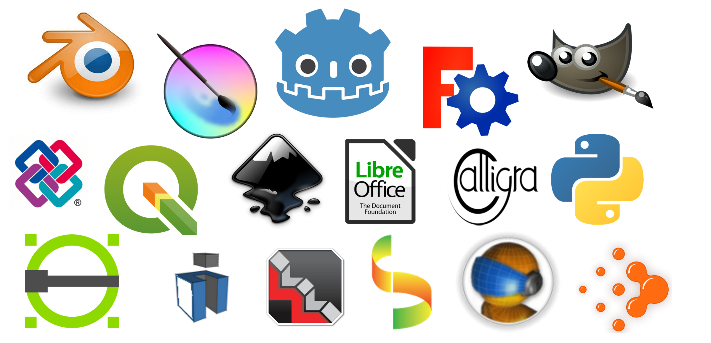

# ARQB39-TECAPP

## Free and Open Source Software aplicados ao planejamento e ao projeto

### Aula 02

1. Softwares utilizados
  - [git](https://git-scm.com/)
  
  - [Visual Studio Code](https://code.visualstudio.com/)
  
  - [Inkscape](https://inkscape.org/pt-br/)
