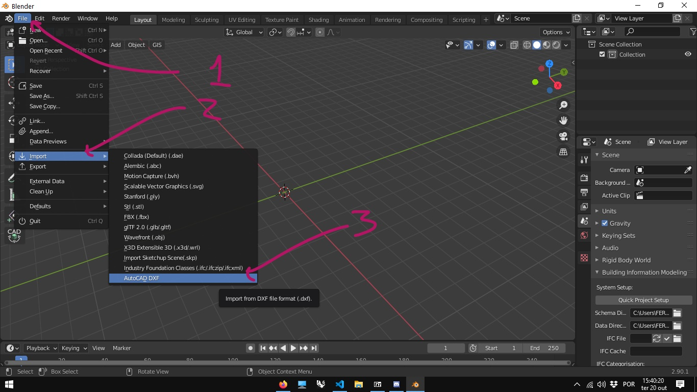
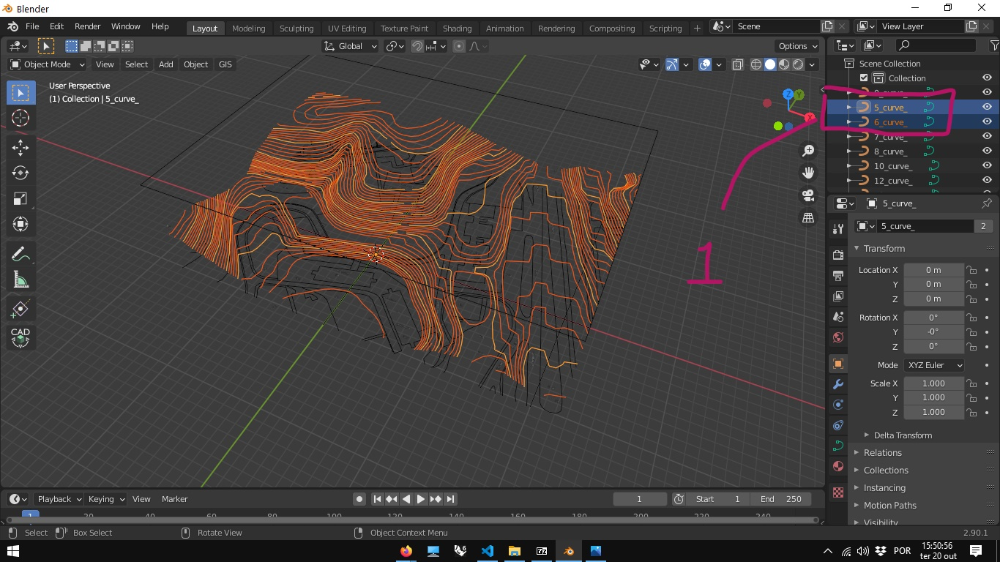
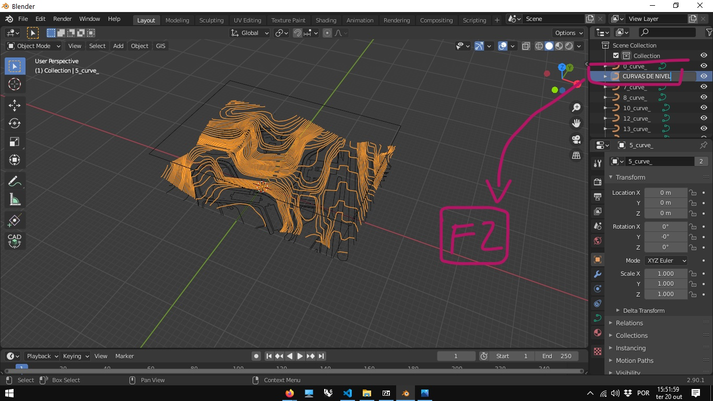
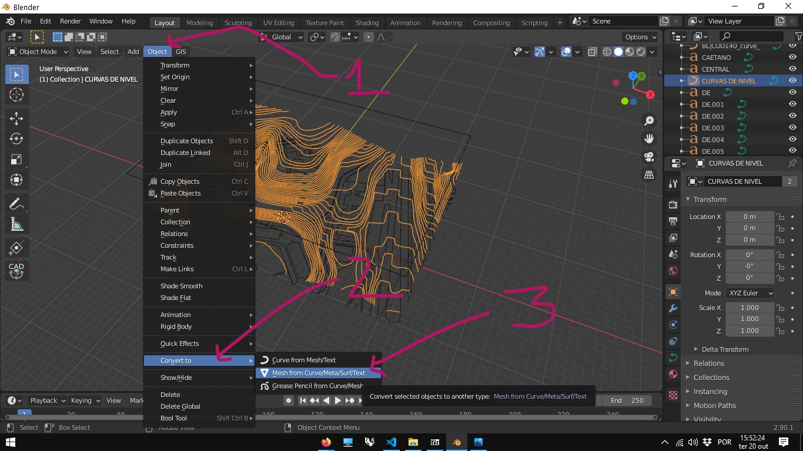
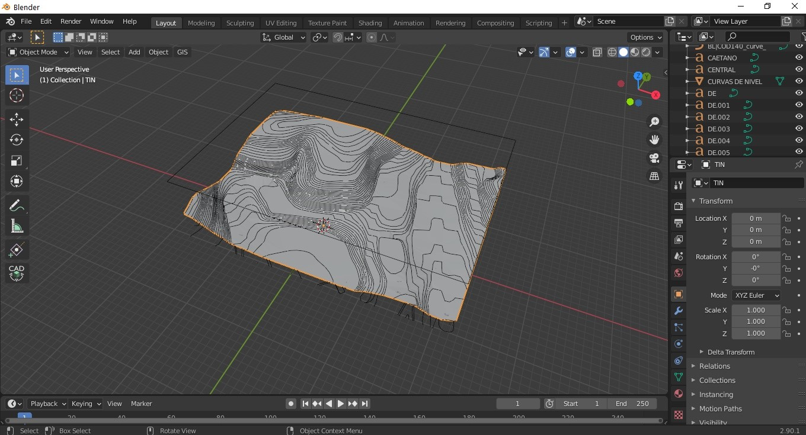

# Instalando o BlenderGis

## Baixando o add-on

Acesse o repositório do Github do [BlenderGis](https://github.com/domlysz/BlenderGIS)


## Instalando

Baixe o arquivo .zip e, pela tela de Edit->Preferences->Add-ons, clique na opção **Install**


navegue até o local onde baixou o arquivo .zip, selecione o arquivo e aperte o botão **install add-on**


De volta à tela de Add-ons, clique na seta para visualizar as propriedades do Add-on instalado. Em todos os plug-ins vamos encontrar ao menos um botão que leva para o site da documentação (Help e informações de funcionamento do Plug-in) e um botão para remover o Add-on instalado. Em alguns casos, mais configurações vão aparecer.

Ative a **checkbox** ao lado da seta para instalar o Add-on. 


Dependendo da complexidade do Add-on a instalação pode ser muita rápida ou demorar um pouco. Aguarde. O Blender esta descompactando o arquivo .zip e copiando o conteúdo para a pasta de Add-ons da sua instalação. No caso do Windows 10, esta pasta fica no caminho:

```
C:\Users\<seu nome de usuário do windows>\AppData\Roaming\Blender Foundation\Blender\<número da versão do Blender instalada e.g. \2.90\>\scripts\addons
```

Que também pode ser acessado digitando a lina abaixo na barra de endereço do **Explorador de Arquivos** do Windows (apenas mudando o número da versão do Blender):

```
%AppData%\Blender Foundation\Blender\2.90\scripts\addons
```

No fim desta execução, a **checkbox** aparecerá marcada e a instalação concluída. Alguns Add-ons, contudo, exigem configurações adicionais que aparecerão nesta mesma tela, assim que a **checkbox** aparecer como marcada.

## Configurações Adicionais do BlenderGis

No BlenderGis é necessário configurar uma pasta de cash e é recomendável adicionar o sistema de coordenadas geoespaciais mais utilizado na sua região.

### Cash Folder

Crie uma pasta para o cash do BlenderGis em algum lugar do seu drive e clique no ícone para definir o caminho, conforme figura abaixo:


Navegue até a pasta criada e clique no botã para aceitar.


### Sistema de Projeção Sirgas 2000

O sistema de corrdenadas de referência Sirgas 2000 é o mais utilizado no Brasil. Informações sobre este sistema e seu código EPSG podem ser conferidas no [link](https://epsg.io/4674).

Na seção **spatial reference systems** das configurações do BlenderGis, clique no botão **Add**


Em seguida preencha a caixa de diálogo conforme indicado. 


```
EPSG:4674
SIRGAS 2000
```

Para configurar qualquer outro sistema de coordenadas, pasta pesquisar o nome e o EPSG na internet e repetir as operações descritas acima.

## Vídeo com instruções de instalação e uso:

__________________________________
### Canal [Nicko16](https://www.youtube.com/channel/UCIldsycnma5sHR1VRP38vhg)

<iframe width="560" height="315" src="https://www.youtube.com/embed/YNtKnmRXVlo" frameborder="0" allow="accelerometer; autoplay; clipboard-write; encrypted-media; gyroscope; picture-in-picture" allowfullscreen></iframe>
__________________________________

[Exemplo de curvas de nível - terreno dwg e dxf](https://255ribeiro.github.io/cad_intro/terreno_exemplos.zip)

## Modelagem de terrenos a partir das curvas de nível com o BlenderGis

### [arquivo dxf com curvas de nível](../exemplos/terreno_mov_origem.dxf)

1. Baixe o arquivos acima.
1. Importe o arquivo DXF no Blender.
 
1. Em modelos muito grades, é recomendado aumentar o valor da variável **Menu N -> aba View -> Seção view -> end**. foi utilizado o valor 1000000 (um milhão de metros ou 100 km) neste exemplo.
 
2. Localize a(s) camada(s) onde estão as curvas de nível - As camadas(layers) de um arquivo dxf são importadas como objetos.
 
3. No arquivo baixado, as camadas 5 e 6 contém respectivamente as curvas de 5 em 5 metros e as curvas intermediárias.
4. Selecione os objetos 5_curves e 6_curves no Outliner e junte em um único obejto usando o atalho ctrl+j.
 
5. Renomeie (tecla F2)a nova camada para CURVAS DE NIVEL.
 
6. converta as curvas em Mesh.
 
1. No Menu do Plug-in BlenderGis, com a Mesh das curvas de nível selecionada, escolha a opção **Gis -> Mesh -> Delanay**.
 
1. Uma malha é gerada a partir das curvas
   
2. Mudando para o **Edit Mode** pode-se ver a malha triangular gerada pelo comando.
 

 [arquivo terreno_malha_triangular.blend](./terreno_malha_triangular.blend)