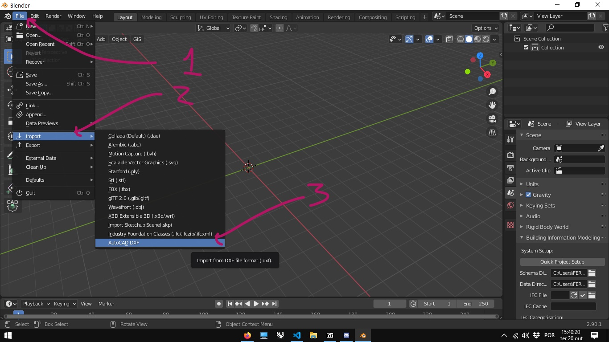
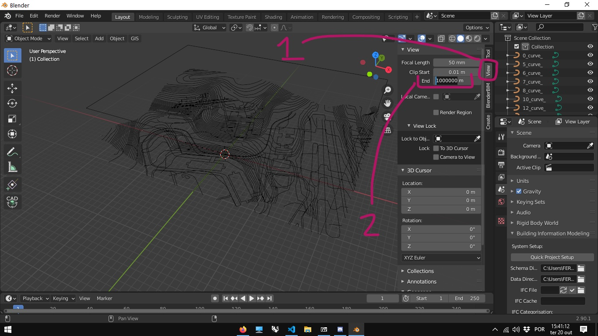
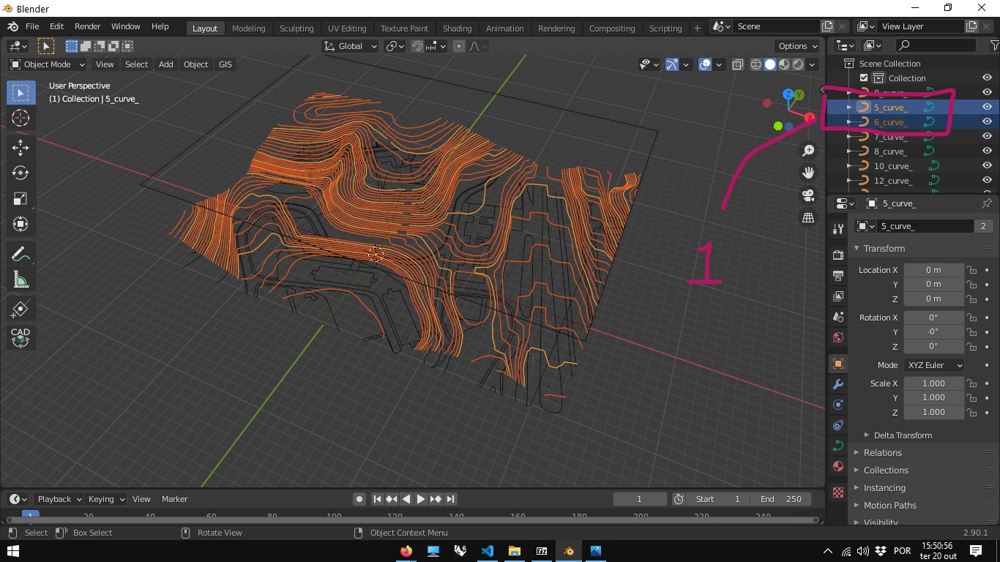
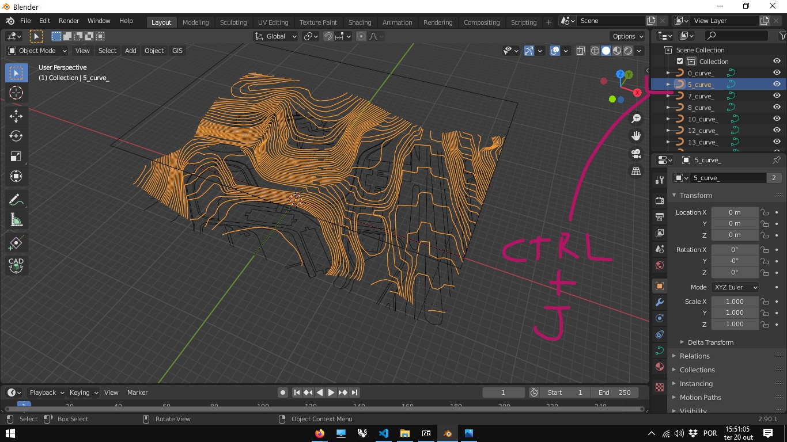
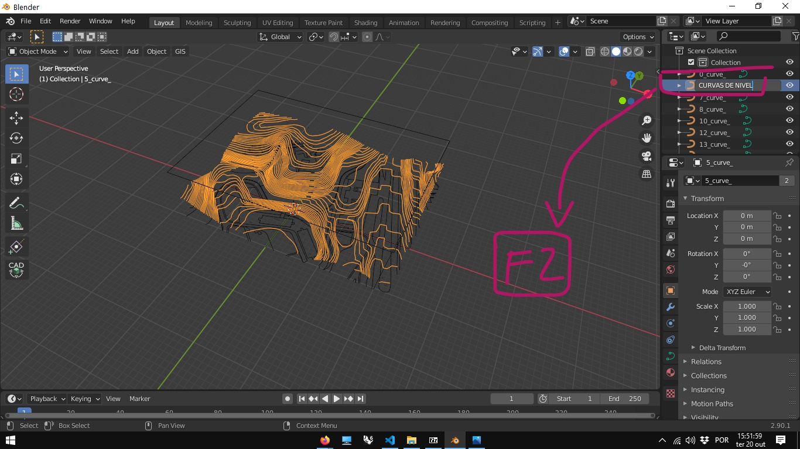
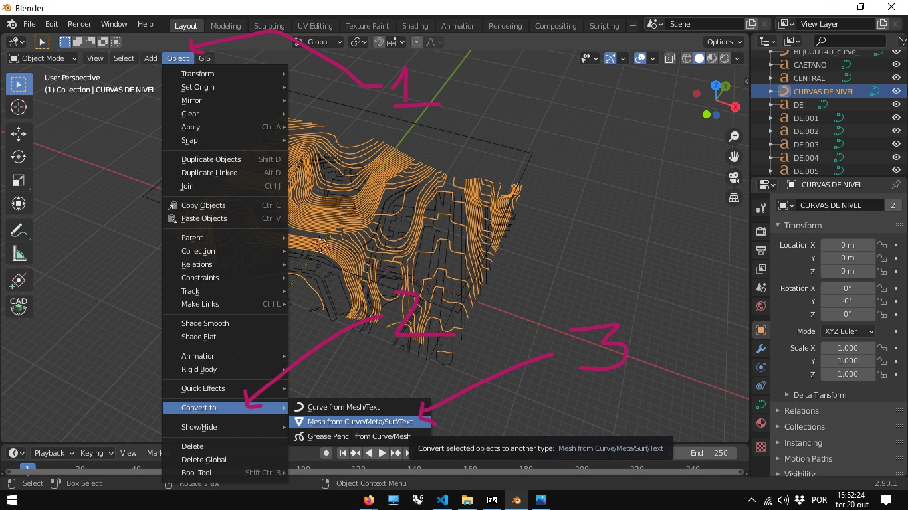
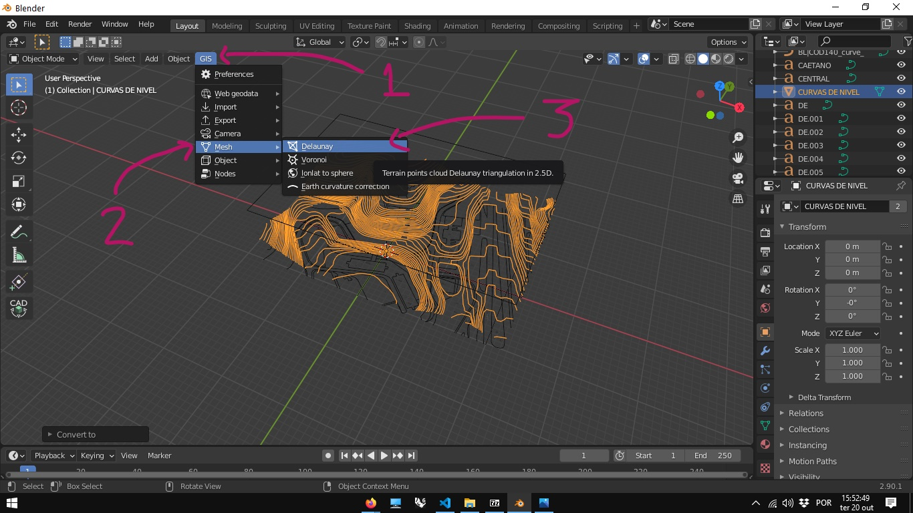
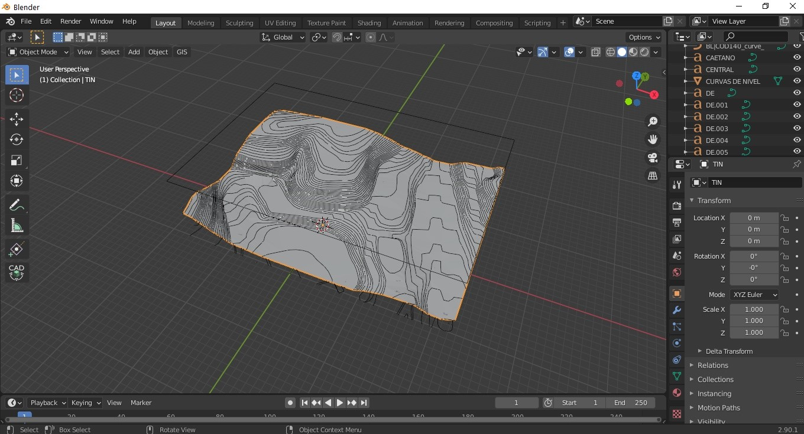
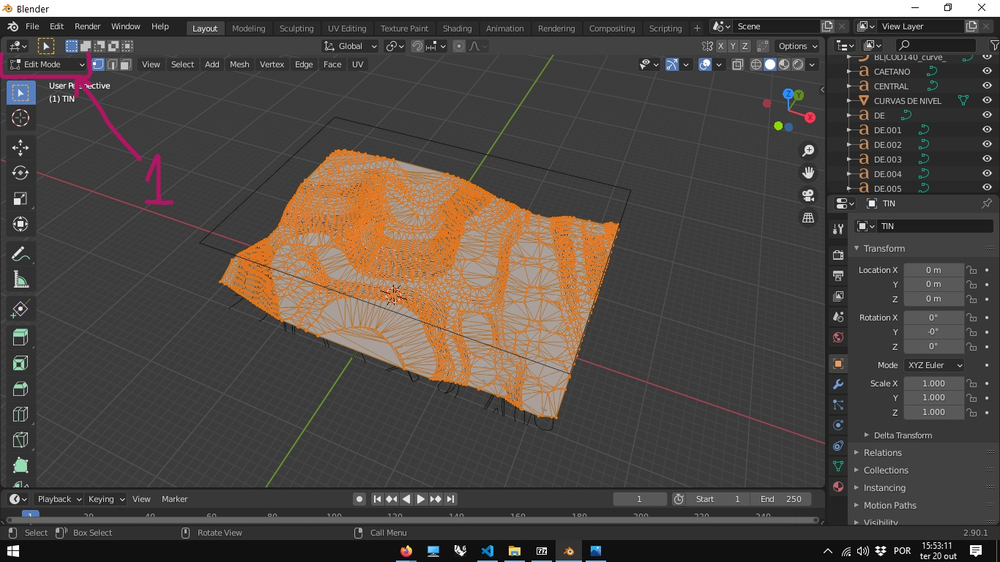

# Modelagem de terrenos a partir das curvas de nível com o BlenderGis

## [arquivo dxf com curvas de nível](../exemplos/terreno_mov_origem.dxf)

1. Baixe o arquivos acima.
1. Importe o arquivo DXF no Blender.
 
1. Em modelos muito grades, é recomendado aumentar o valor da variável **Menu N -> aba View -> Seção view -> end**. foi utilizado o valor 1000000 (um milhão de metros ou 100 km) neste exemplo.
 
2. Localize a(s) camada(s) onde estão as curvas de nível - As camadas(layers) de um arquivo dxf são importadas como objetos.
 
3. No arquivo baixado, as camadas 5 e 6 contém respectivamente as curvas de 5 em 5 metros e as curvas intermediárias.
4. Selecione os objetos 5_curves e 6_curves no Outliner e junte em um único obejto usando o atalho ctrl+j.
 
5. Renomeie (tecla F2)a nova camada para CURVAS DE NIVEL.
 
6. converta as curvas em Mesh.
 
1. No Menu do Plug-in BlenderGis, com a Mesh das curvas de nível selecionada, escolha a opção **Gis -> Mesh -> Delanay**.
 
1. Uma malha é gerada a partir das curvas
   
2. Mudando para o **Edit Mode** pode-se ver a malha triangular gerada pelo comando.
 

 [arquivo terreno_malha_triangular.blend](./terreno_malha_triangular.blend)