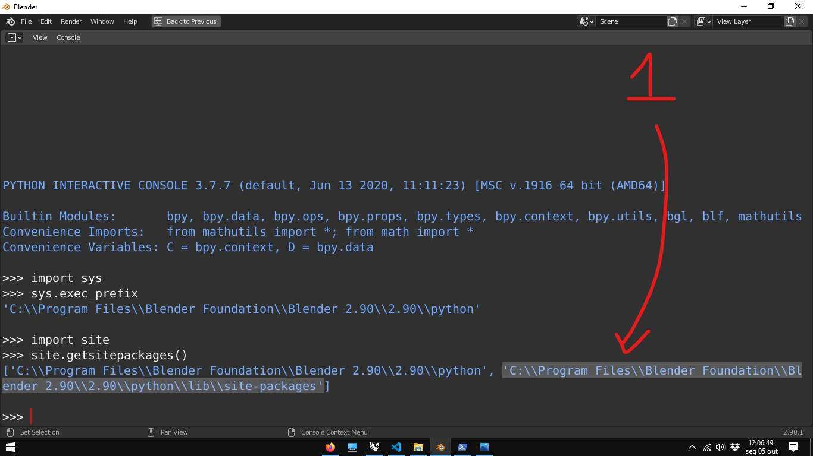
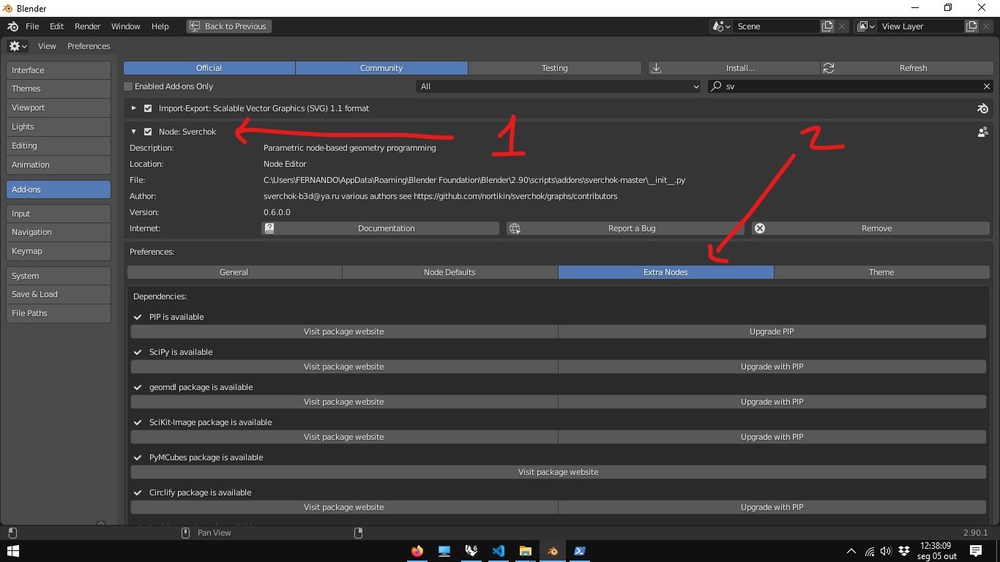
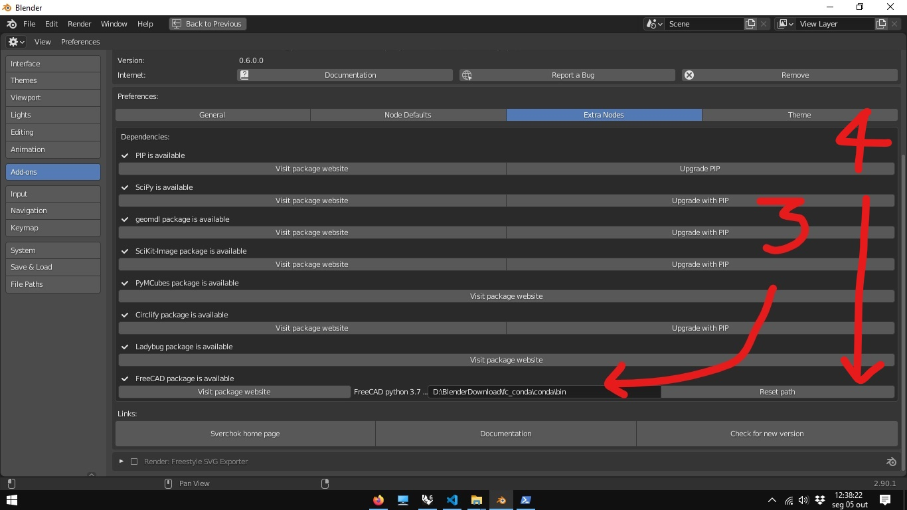

 # Instalando dependências do Sverchok
 

```shell
 ______ _    _ _______  ______ _______ _     _  _____  _     _
/______  \  /  |______ |_____/ |       |_____| |     | |____/
______/   \/   |______ |    \_ |_____  |     | |_____| |    \_
initialized.

```
## Instalar o Pip

### Toda vez que se instala uma nova versão do Blender, é preciso habilitar o pip

#### O pip é um sistema de instalação de pacotes do python via linha de comando. Para instalar o pip, siga as instruções abaixo:

Encontrar a pasta python no Blender:
1. Vá para o workspace script 
1. No editor *python console* digite (ou copie e cole):

```Python
import sys
sys.exec_prefix
```
O console ira imprimir o caminho para a pasta onde ficam os arquivos do ambiente Python da sua instalação do Blender.


1. Copie o endereço (ctrl + c)

1. Abra o Windows Power Shell (como administrador).


###### Uma das maneiras de se abrir o **Powershell** como administrador é :  1. No menu iniciar, clicar no ícone do **Powershell** com o botão direito do mouse 2. Clicar na opção **mais** 3. Clicar na opção **Executar como Administrador**.

1. No PowerShell, digite cd e cole o endereço copiado (ctrl + v).


```shell
cd "C:/Program Files/Blender Foundation/Blender/2.80/python/"
```


1. Para habilitar o pip, copie e cole as linhas de comando abaixo. 

```shell
.\bin\python -m ensurepip
.\bin\python -m pip install --upgrade pip setuptools wheel
```

1. Volte para O console do Python do Blender e digite:

```Python
import site
site.getsitepackages()
```



1. Copie (ctrl + c) o segundo endereço mostrado pelo comando. Este endereço termina com uma pasta denominada como ***site-packages***.

2. Substitua o endereço abaixo endereço copiado no passo anterior (crtl + v). É recomendado fechar o Blender para quando for instalar programas usando o pip.

```shell
 .\Scripts\pip install --upgrade scipy geomdl SciKit-Image PyMCubes Circlify ladybug-core -t 'C:\\Program Files\\Blender Foundation\\Blender 2.90\\2.90\\python\\lib\\site-packages'
```

###### Na versão atual, o pip apresenta um erro na instalação das dependências do ladybug-core. Isso pode ser corrigido instalando o add-on do LadyBug no abaixo:
[https://blenderbim.org/download.html](https://blenderbim.org/download.html)

## Dependência do FreeCAD

O **Freecad** é usado pelo **Sverchok** para a criação e manipulação de Sólidos. Atualmente o **Blender** utiliza o Python na versão 3.7.X. O **FreeCAD** 0.18 Utiliza a versão 3.6.x e o **FreeCAD** 0.19 (ainda não lançado oficialmente), utiliza a versão 3.8.x.

No entanto, é possível encontrar uma versão do **FreeCAD** compilada para o Python 3.7.x no endereço abaixo:

[sgrogan/FreeCAD](https://github.com/sgrogan/FreeCAD/releases/tag/PY3.7-win)

Baixe a versão conda-0.18.3.7z (recomenda-se o programa [7zip](https://www.7-zip.org/download.html) para extrair o conteúdo do arquivo)

Baixe e extraia o conteúdo para uma pasta com endereço conhecido (e.g. c:\fc37\...)

Procure o endereço da pasta **bin** dentro das pastas descompactadas.

Execute o Blender como administrador.


###### Uma das maneiras de se abrir o **Blender** como administrador é : 1. No menu iniciar, clicar no ícone do **Blender** com o botão direito do mouse 2. Clicar na opção **mais** 3. Clicar na opção **Executar como Administrador**.

No menu Edit->Preferences vá para a opção Add-ons e procure o Sverchok (basta digitar **sv** no campo de pesquisa)

Abra as opções do Add-on Sverchok e procure a opção **extra nodes**



Na opção **FreeCAD Package** copie o endereço da pasta **bin** da versão descompactada e aperte o botão **RSeset Path**



Caso ocorra algum problema em algum passo da instalação, consulte a documentação do [add-on](https://github.com/nortikin/sverchok/).

## FIM