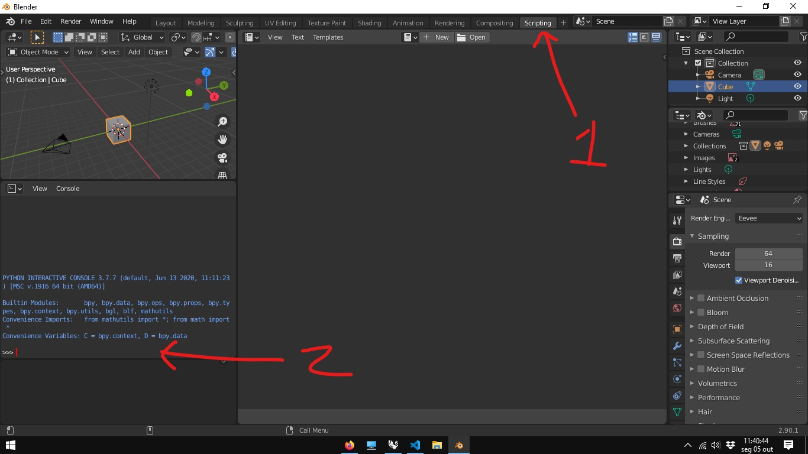
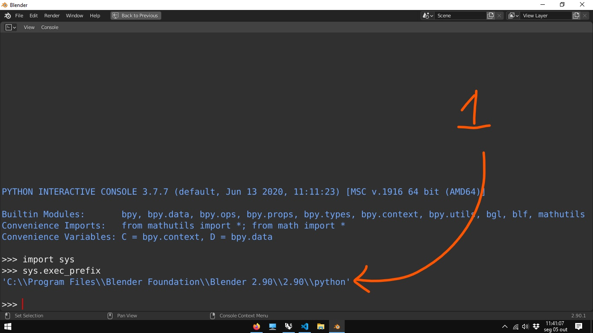
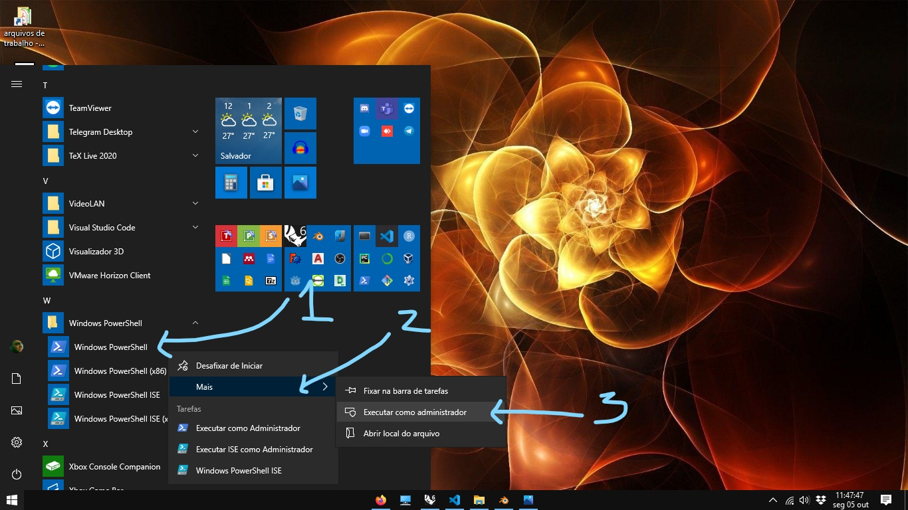
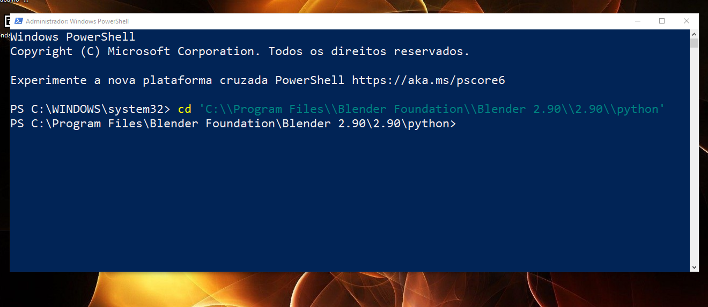

# Habilitar o pip

## O [pip](https://pypi.org/project/pip/) é um sistema de instalação de pacotes do Python via linha de comando. Para habilitar o pip no Blender, siga as instruções abaixo:

### Atualmente, toda vez que se instala uma nova versão do Blender, é preciso habilitar o pip

Encontrar a pasta python no Blender:
1. Vá para o workspace script 
1. No editor *python console* digite (ou copie e cole):

```Python
import sys
sys.exec_prefix
```
O console ira imprimir o caminho para a pasta onde ficam os arquivos do ambiente Python da sua instalação do Blender.




1. Copie o endereço (ctrl + c)

1. Abra o Windows Power Shell (como administrador).


###### Uma das maneiras de se abrir o **Powershell** como administrador é : **1** No menu iniciar, clicar no ícone do **Powershell** com o botão direito do mouse. **2** Clicar na opção **mais**. **3** Clicar na opção **Executar como Administrador**.

1. No PowerShell, digite cd e cole o endereço copiado (ctrl + v).


```shell
cd "C:/Program Files/Blender Foundation/Blender/2.80/python/"
```



1. Para terminar o processo e atualizar a versão do pip e de suas principais dependências, copie e cole as linhas de comando abaixo. 

```shell
.\bin\python -m ensurepip
.\bin\python -m pip install --upgrade pip setuptools wheel
```
