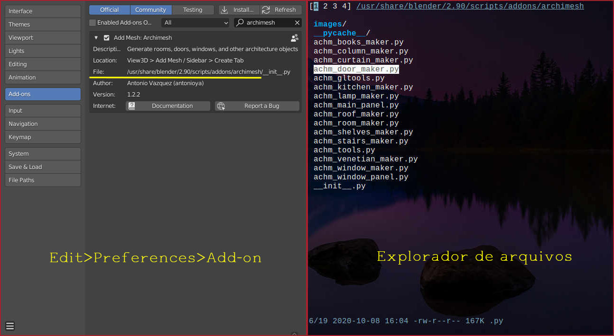
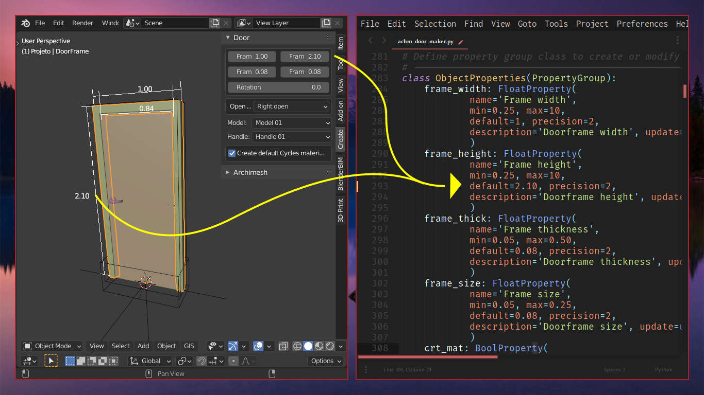

# _Archimesh_

---

Durante a aula de Archimesh, foi apontado pelo professor que o add-on considera para a altura da porta, o valor de 2.10.

Precisamos que esse valor seja 2.18, ou seja, 2.10 para a folha da porta, mais a altura da peça que está entre a folha da porta e a alvenaria.

Alterar esse valor toda vez que forem inseridas várias portas, pode se tornar uma tarefa cansativa. Vamos evitar esse trabalho editando o script do add-on?

Para fazer isso, precisamos identificar onde ele está localizado. Abra o blender e no menu `Editar > Preferências > Add-ons`.

Digite no campo de pesquisa o nome `archimesh` e clique na seta ao lado do texto **Add Mesh**, para expandir o diálogo.

Nesta etapa, descobrimos que os arquivos do plugin estão numa pasta protegida pelo sistema operacional.

Se você estiver usando Windows, provavelmente a pasta estará dentro de `C:/Arquivos de Programas/Blender Foundation/...` , que também é protegida pelo sistema. Nesse caso, é preciso abrir um editor de texto como administrador.

> :warning: **ATENÇÃO**  
> Faça um backup do arquivo, por segurança.

Escolha o programa que você mais gosta e, com o clique direito do mouse, escolha abrir o editor de texto como administrador. Se você usa alguma distribuição Linux ou macOS, use o comando `sudo`.

Com o editor de texto aberto, use-o para abrir o arquivo chamado `achm_door_maker.py`. Ele é o responsável pelos parâmetros de criação de porta.

Ao analizar o arquivo `achm_door_maker.py`, descobrimos que a altura da porta é controlada pela variável **frame_height** e está na linha **293**, como ilustrado na imagem abaixo e a direita.

Edite o valor de 2.1 para 2.18, tomando o cuidado de escrever ponto final, não uma vírgula. Aqui a vírgula tem outra função.

Salve o arquivo, feche o Blender e abra-o novamente.

Sinta-se a vontade para experimentar outros valores. Ou em lugares diferentes, como a largura da porta, por exemplo.

Consegue identifica-la em **frame_widht**? Que tal ela sempre ser criada com 0.96 ??

> :warning: **ATENÇÃO**  
> Sempre que você atualizar para outra versão do Blender, as modificações serão perdidas.

Pronto! Agora você aprendeu a editar um script, na forma mais básica possível.

Bons estudos!
