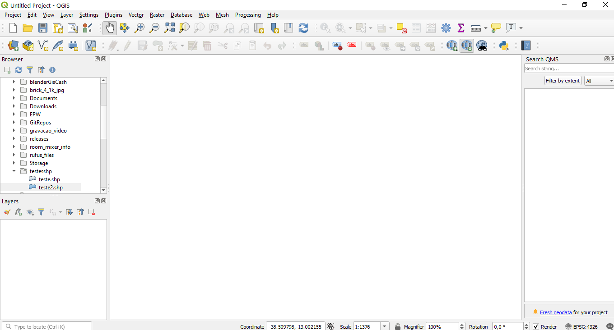

# QGis básico

## Interface

## Formatos de arquivos

### Vetoriais
1. [Shapefiles](https://pt.wikipedia.org/wiki/Shapefile)
   - Exemplos de shapefile

        [shape UFBA](./Edificacoes_UFBA.zip)

        [shape_RMS](./BaseSSA.zip)

1. [Geopackages](https://www.geopackage.org/)
   
   - Exemplo de Geopackage

2. [Geojson](https://geojson.org/)
   
   - Exemplo de GeoJson
        [Municípios da Bahia](https://raw.githubusercontent.com/tbrugz/geodata-br/master/geojson/geojs-29-mun.json)

### Raster

1. [GeoTiff](https://pt.wikipedia.org/wiki/GeoTIFF)

### Tabelas

[exemplo de tabela](./estimativa_2018_pop.csv)

## Elementos dos arquivos

### Geometria

### Tabela de Atributos

#### Tipos de dados dos atributos